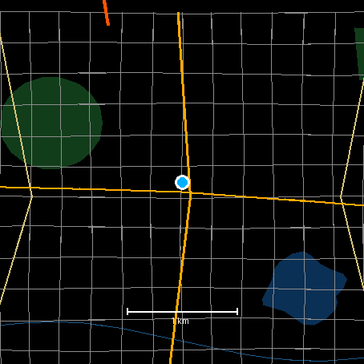
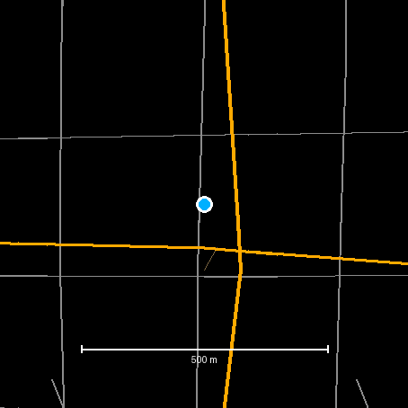
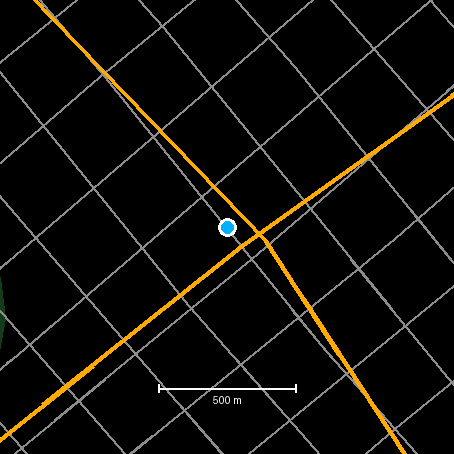

# Offline Maps for Garmin

A pannable, zoomable map for Garmin watches that have no built-in cartography —
starting with the **Venu 3** and **Venu 3S**. No phone, no network, no
subscription: the map is compiled into the app.

<p align="center">
  
  
  
</p>

<sub>Rendered from the bundled synthetic demo pack by `tools/mappack`'s preview
renderer, which reproduces the on-watch drawing code pixel for pixel.</sub>

---

## TL;DR

**What.** A real map on a watch that Garmin ships no cartography for. Pan, zoom,
follow your position, north-up or heading-up — with the phone at the hotel and
the radio off.

**How.** OpenStreetMap data is quantised into binary vector tiles by a Python
packer, base64'd into Connect IQ `jsonData` resources, and **compiled into the
app**. The watch decodes tiles straight into draw calls, once, into an off-screen
bitmap; every frame after that is a blit. There is no runtime data path at all —
no network, no filesystem, no companion app.

```
OpenStreetMap                tools/mappack                    the watch
─────────────                ─────────────                    ─────────
Overpass or .osm.pbf   →   classify by tag             →   MapIndex.mc  (generated switch)
                           project to Web Mercator          jsonData resources (base64)
                           simplify (Douglas–Peucker)              ↓
                           clip into 256 px tiles           TileStore   (lazy load + LRU)
                           delta + zigzag varints                 ↓
                           group tiles into blocks          TileReader  (binary cursor)
                           emit base64 JSON + index               ↓
                                                            MapRenderer (into a BufferedBitmap)
```

**Why it looks like this.** Four measured limits leave no other option: 768 KB of
app RAM, ~128 KB of key-value storage, no filesystem API at all, and under
1 KB/s over BLE. Sources and the rest in [docs/DEVICES.md](docs/DEVICES.md).

Then one performance reality: every `drawLine` is an interpreted call, and a
full redraw has to stay well under a second to feel like a map rather than a
slideshow. So the map renders **once** into an off-screen `BufferedBitmap` when
the view changes, and each frame after that just blits it — while your finger is
down, the same buffer is blitted at an offset, and the re-render happens when you
let go.

**Three moving parts:** `tools/mappack/` (Python, tested), `source/` (Monkey C,
needs the SDK), and a byte format that [three implementations](docs/FORMAT.md)
must agree on.

Deeper: **[docs/](docs/README.md)** — architecture, rendering, packer, format,
devices, development.

## Why this exists

The Venu 3 is a capable watch with no map. Garmin's own cartography is not
available for it (`WatchUi.MapView` is not supported on this device), and the
Connect IQ map apps that do exist stream raster tiles, which means they need
your phone in range, an internet connection, and usually a tile subscription.

This one takes the other road: **vector map data, quantised and compiled into
the app**, drawn on the watch. Once installed it works in a tunnel, on a plane,
abroad with the phone at the hotel — anywhere.

## What it does today

- Pan by dragging, zoom with on-screen buttons, over the whole packed region
- **Follow me** — recentres on every GPS fix; one tap to re-engage after panning
- **North-up or heading-up** — the map turns with you, with a north arrow
- Roads by class, water, rivers, parks and forests, railways, paths
- Scale bar, dark and light themes, position marker with a heading wedge
- Everything offline, from a pack you build for your own area

## Quick start

You need the [Connect IQ SDK](https://developer.garmin.com/connect-iq/sdk/)
(free Garmin account) with `monkeyc` on your `PATH`, plus Python 3.9+.

```bash
git clone https://github.com/Chemaclass/garmin-offline-maps.git
cd garmin-offline-maps

make key                 # one-off signing key, kept out of git
make build               # compiles with the bundled demo map
make sim                 # opens the simulator and side-loads it
```

`make build` produces `bin/offline-maps-venu3.prg`. To put it on the watch,
plug it in over USB and copy that file into `GARMIN/APPS/` on the watch's
storage, then eject. The app appears in the activity/app list.

## Building a map of your own area

The bundled pack is a synthetic demo town. Replace it with somewhere real:

```bash
# west,south,east,north — this is central Madrid
make pack BBOX=-3.75,40.38,-3.65,40.45 NAME="Madrid"
make build
```

That queries [Overpass](https://overpass-api.de/) for just the features the
renderer draws, tiles them, and writes both the map resources
(`mapdata/active/`) and the generated index (`source/generated/MapIndex.mc`).

For anything bigger than a city, download a regional extract from
[Geofabrik](https://download.geofabrik.de/) instead of hammering Overpass:

```bash
make pack INPUT=~/Downloads/madrid-latest.osm.pbf NAME="Madrid"   # needs: pip install osmium
```

Preview it before you flash it:

```bash
cd tools/mappack
python3 -m mappack.preview --zoom 16 --out preview.png
```

### How much area fits

The packer prints a size report. Rough numbers at the default settings
(zooms 12/14/16, roads + water + green, no buildings):

| Area covered | In-app size | jsonData resources |
|---|---|---|
| 10 × 10 km (a town) | ~0.4 MB | ~20 |
| 30 × 30 km (a city + surroundings) | ~3 MB | ~70 |
| 60 × 60 km (a metro region) | ~11 MB | ~200 |

Two ceilings to respect, both of which the packer warns about: the Connect IQ
store rejects `.iq` bundles over **15 MB**, and Connect IQ runs out of resource
ids somewhere around **255** per type.

If a pack comes out too big, the knobs — and the order to reach for them — are
in [docs/PACKER.md](docs/PACKER.md#budgets). Shrinking the bbox beats all of them.

## Controls

| Action | Gesture |
|---|---|
| Pan | drag |
| Zoom in / out | tap the **+** / **−** buttons on the right |
| Centre on me | tap the crosshair on the left, or press **Enter** |
| Menu | long-press the screen, or the **Menu** key |
| Exit | **Back** |

The menu holds heading-up, dark theme, an on-screen stats overlay for debugging
render times, and the pack's attribution.

## Tests

```bash
make test
```

67 tests, split by what they are testing rather than by what they import:

```
tools/mappack/tests/
├── unit/          one file per mappack module: varint, geom, classify, osmread
├── integration/   pipeline stages: pack, emit, preview
└── contract/      agreements with the Monkey C: tile format, palette/layer ids
```

The `contract/` group is the interesting one. The watch code cannot be unit
tested without the SDK, so two Python modules stand in for it: `decode.py` is a
line-by-line mirror of `source/TileReader.mc`, and `preview.py` re-implements
`source/MapRenderer.mc` — same projection, same draw order, palette scraped live
out of `source/Palette.mc` — rendering real PNGs from the real generated
artefacts. If the preview looks right, the watch maths is right.
Details in [docs/DEVELOPMENT.md](docs/DEVELOPMENT.md#testing).

CI runs the whole suite on every push and uploads the preview renders as build
artefacts. It also compiles the app for both products, once you add Garmin SDK
credentials as repository secrets (see `.github/workflows/ci.yml`).

## Adding more devices

Add the product id to `manifest.xml`, then check
[docs/DEVICES.md](docs/DEVICES.md#adding-another-device) for that model's
watch-app memory — it decides whether the off-screen buffer fits. The renderer
falls back to drawing straight to the screen when it does not, so a tight device
degrades rather than crashes.

Good next candidates, all round and touch-capable with the same API level:
`vivoactive5`, `venu2`, `venu2s`, `venu2plus`, `fr165`, `fr265`, `fr965`.

## Licence and attribution

The code is MIT — see [LICENSE](LICENSE).

Map data is **not** covered by that licence. Packs built from OpenStreetMap are
derived works under the [ODbL](https://opendatacommons.org/licenses/odbl/), so
anything you publish must credit "© OpenStreetMap contributors". The app carries
that credit in its About screen, and the packer writes it into every pack's
metadata. If you pack a different source, set `--attribution` accordingly and
check that source's terms before publishing to the Connect IQ store — Garmin's
review guidelines put the licensing burden on you.

## Status

No release cut yet — [CHANGELOG.md](CHANGELOG.md) lists what exists today.

Working code, not yet flashed to hardware. The map format, the packer, the
generated index and the rendering maths are covered by tests and by the preview
renderer; the Monkey C has not been through `monkeyc` yet, so budget one round
of compile fixes on first build. Real-device notes to watch for are collected in
[docs/DEVICES.md](docs/DEVICES.md).

## Roadmap

- [ ] First compile + on-watch timing measurements
- [ ] Waypoints: drop, save, bearing and distance
- [ ] Route overlay from a GPX packed alongside the map
- [ ] Place-name labels (needs a text layer in the format)
- [ ] Widget/glance entry point
- [ ] Connect IQ store release
